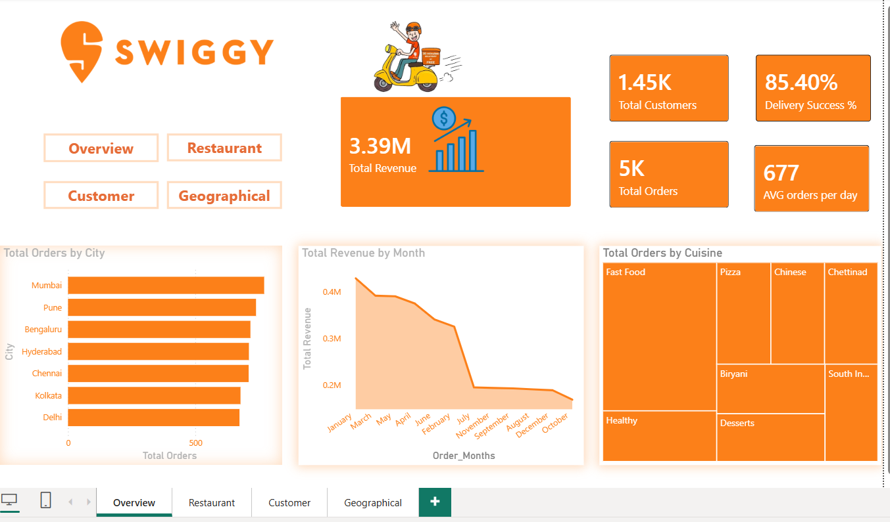
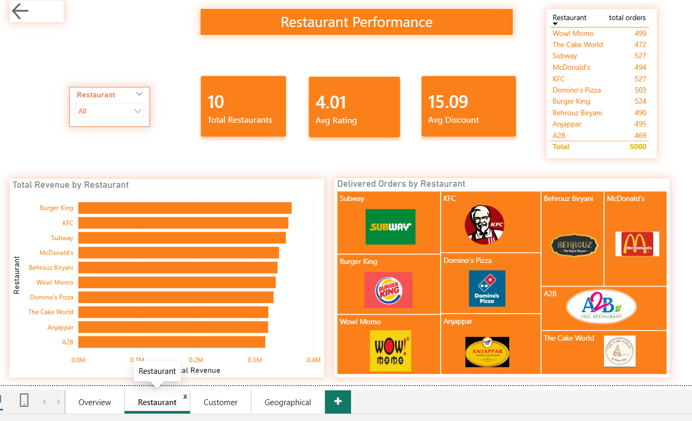
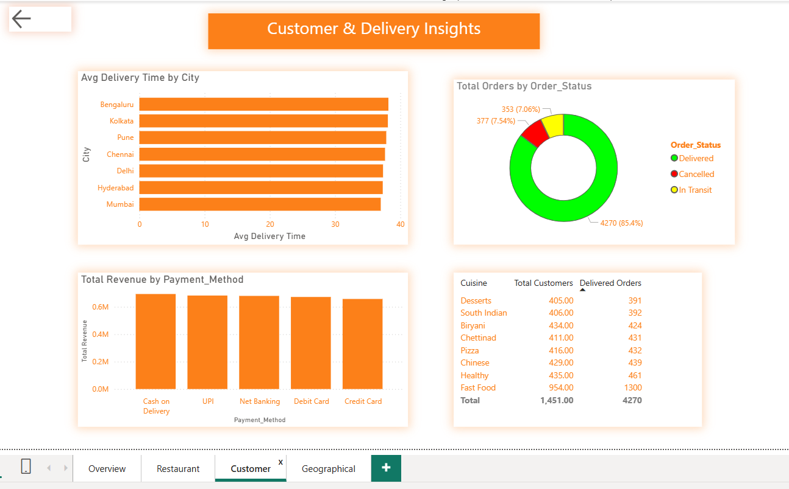
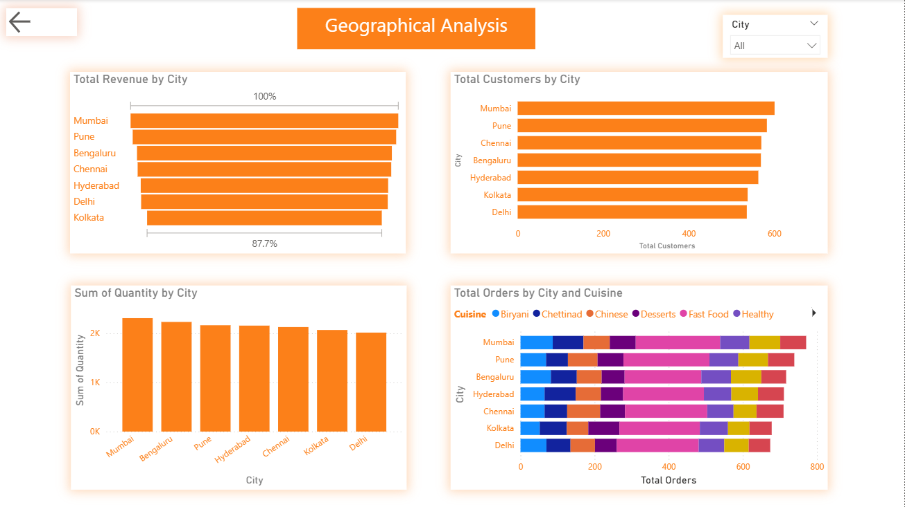

# Swiggy Power BI Dashboard

## Project Overview
This Power BI dashboard provides insights into Swiggy's restaurant performance, customer behavior, and geographical distribution.

## Dashboard Pages
1. Overview
2. Restaurants Analysis
3. Customer Analysis
4. Geography Analysis

## Key Metrics
- Total Orders
- Revenue Analysis
- Customer Distribution
- Restaurant Ratings
- Regional Performance

## Tools Used
- Power BI
- Power Query
- DAX
- Excel

## Dashboard Preview
# Swiggy Power BI Dashboard

### Overview

### Restaurants Analysis

### Customer Analysis

### Geography Analysis

